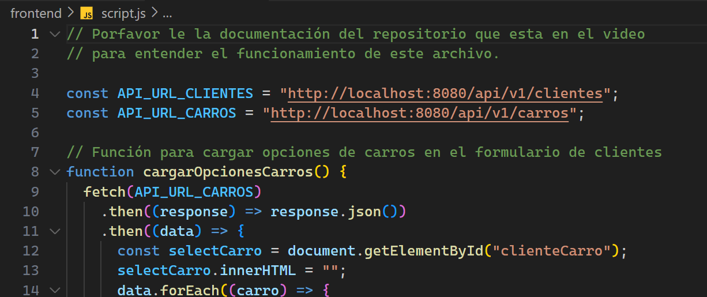

# Documentación de API Rest Ventas de Carro v1.0.0
## Descripción del proyecto

Este proyecto radica en la creación de una API Rest que permita tener un CRUD
para Clientes y Carros. Además, como bonus se cuenta con el frontend para visualizar la API de mejor manera (para ejecutar el frontend se recomienda usar GOOGLE CHROME).


___
## Recursos
El proyecto esta creado con las siguientes tecnologías y APIs.

| Plugin                | URL                      |
|-----------------------|--------------------------|
| Spring Web            | https://start.spring.io/ |
| Spring Data JPA       | https://start.spring.io/ |
| Lombok                | https://start.spring.io/ |
| H2 Database           | https://start.spring.io/ |
| Spring Doc (opcional) | https://springdoc.org/#getting-started |
___
## Accesos

Acceso a la base de datos H2 mediante URL:

```sh
url: http://localhost:8080/h2-console/
JDBC URL: jdbc:h2:mem:ventas	
user: sa
password: 
```


Acceso a la UI de la documentación de la API mediante URL:
```sh
url: http://localhost:8080/swagger-ui/index.html
```

___
## Uso en Postman

___
### Carro
#### GET
```sh
http://localhost:8080/api/v1/carros
```

### POST (crear Carro)
```sh
http://localhost:8080/api/v1/carros
```
Hay que insertar un JSON para esta petición.

``` json
{
    "nombre": "Mustang",
    "modelo": "2019",
    "valor": 5500
}
```

### POST (editar Carro)
```sh
http://localhost:8080/api/v1/carros/editar/1
```

Hay que insertar un JSON para esta petición.

``` json
{
    "nombre": "Mustang",
    "modelo": "2024",
    "valor": 11500
}
```

### DELETE
```sh
http://localhost:8080/api/v1/carros/eliminar/1
```
---

### Cliente
#### GET
```sh
http://localhost:8080/api/v1/clientes
```

### POST (crear Cliente)
```sh
http://localhost:8080/api/v1/clientes
```
Hay que insertar un JSON para esta petición.

``` json
{
    "nombre": "Harvey",
    "nacionalidad": "MEX",
    "telefono": "88212131",
    "carro": {
        "idCarro": 1
    }
}
```

### POST (editar Cliente)
```sh
http://localhost:8080/api/v1/clientes/editar/1
```

Hay que insertar un JSON para esta petición.

``` json
{
    "idCliente": 1,
    "nombre": "Harvey Dev",
    "nacionalidad": "MEX",
    "telefono": "1111111111",
     "carro": {
        "idCarro": 2
    }
}
```

### DELETE
```sh
http://localhost:8080/api/v1/clientes/eliminar/1
```

## Uso del Front End

El uso de este apartado es opcional, solo se uso como ejemplo en el video, pero en el codigo la carpeta "frontend" contiene toda la logica de programacion, en caso de querer utilizar solamente se requiere actualizar
las constantes donde se haran las peticiones de la API.



Una ves asignadas las URL se recomienda usar solamente Google Chrome.

## Para más información

Añadir SpringDoc: https://springdoc.org/#getting-started
